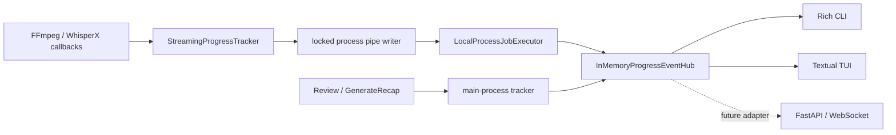

# Потоковый прогресс обработки

## Модель

`ProgressBar` — immutable value object доменного слоя. Он не знает ни о pipeline,
ни о количестве стадий и поэтому может переиспользоваться в других сценариях.

Поля:

- `stage` — стабильное техническое имя текущей стадии;
- `expected_duration` — оценка общей длительности стадии в миллисекундах;
- `current_duration` — фактически прошедшее время стадии в миллисекундах.

`percent` вычисляется как `current_duration / expected_duration * 100`,
округляется до одного знака и ограничивается диапазоном `0.0–100.0`. При
неизвестной ожидаемой длительности (`expected_duration == 0`) значение равно
`0.0`. `remaining_duration` никогда не бывает отрицательным.

Методы обновления возвращают новый экземпляр. `update_stage` всегда начинает
новую стадию с нулевыми длительностями.

Сведения, специфичные для одного запуска, находятся в `ProgressEvent`:

- `operation_id`;
- `stage_index` и `stage_count`;
- `timing_available`;
- тип события;
- снимок `ProgressBar`.

Типы событий: `started`, `updated`, `stage_completed`, `completed`, `paused`,
`failed`, `canceled`. Последние четыре являются terminal events.

## Стадии

Стандартный полный план обработки:

1. `normalizing_audio`;
2. `concatenating_audio`;
3. `loading_transcription_model`;
4. `transcribing`;
5. `loading_alignment_model`;
6. `aligning_transcript`;
7. `loading_diarization_model`;
8. `diarizing_speakers`;
9. `mapping_speakers`;
10. `generating_recap`.

Если alignment или diarization отключены настройками, соответствующая пара
стадий не входит ни в план, ни в `stage_count`. Если alignment включён, но
невозможен для фактически определённого языка, его две стадии завершаются
мгновенно как artificial progress.

`ReviewSpeakerMappings` использует план `mapping_speakers →
generating_recap`, а `GenerateRecap` — только `generating_recap`.
`RestartProcessingJob` лишь создаёт новую pending job и прогресс не публикует.

## Измерение

Каждая стадия имеет собственный прогресс от 0 до 100. Значения разных стадий
не суммируются.

- FFmpeg публикует `out_time_us` из `-progress pipe:1`. Нормализация
  агрегируется по длительности всех исходных файлов, concat считается отдельно.
- WhisperX 3.8.6 передаёт проценты через `progress_callback` для transcription,
  alignment и diarization. Diarization ограничивается 99%, а завершение до 100%
  публикуется только после `assign_word_speakers`.
- Для измеримого work fraction `current_duration` равен wall-clock elapsed, а
  `expected_duration` оценивается как `elapsed / fraction`. До первого
  положительного callback интерфейс показывает `Estimating`.
- Загрузка моделей и speaker mapping используют только переход 0 → 100 и не
  показывают ETA.
- Recap использует artificial fraction: завершённые chunk-запросы плюс
  финальный combine-запрос. Время для этой стадии не показывается.

Tracker ограничивает промежуточные обновления и heartbeat четырьмя событиями в
секунду. Смена стадии и terminal events не задерживаются.

## Доставка событий

Pipe переносит сообщения `progress`, `result` и `error`. Все записи защищены
одним lock, поскольку callback и heartbeat могут выполняться в разных потоках.
Родитель непрерывно пересылает progress events в основной hub и самостоятельно
создаёт `failed` или `canceled`, если worker аварийно завершился.

`InMemoryProgressEventHub` потокобезопасен. Он хранит только последний снимок
активной операции, воспроизводит его позднему подписчику и удаляет сразу после
доставки terminal event. Ошибка одного подписчика логируется и не влияет на
pipeline или других подписчиков. История в SQLite не сохраняется.

`InterfaceRuntime.progress_events` раскрывает application stream интерфейсам.
Это позволяет будущему WebSocket-адаптеру подписаться без зависимости pipeline
от FastAPI. Для нескольких runtime-процессов in-memory реализация должна быть
заменена брокером, сохраняющим тот же application-контракт.

## Интерфейсы

CLI подписывается до запуска `job run`, `review submit` и
`job recreate-recap`. В TTY Rich рисует динамический determinate bar. В
non-TTY в stderr выводится одна строка при смене стадии; stdout остаётся
машиночитаемым и содержит только результат команды.

TUI хранит активные снимки по `operation_id`, обновляет Textual widgets через
`call_from_thread` и показывает прогресс выбранной job. Панель содержит название
стадии, счётчик, процент и время, когда ETA доступна. После terminal event или
завершения worker панель скрывается.
