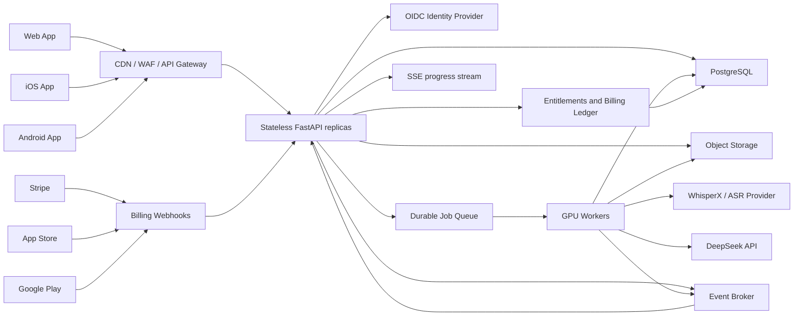

# Web Integration

## Назначение документа

Этот документ описывает готовность NoteKeeper и целевую архитектуру публичного
сервиса, которым одновременно пользуется большое количество пользователей через:

- Web-приложение;
- мобильное приложение;
- единый внешний API.

Целевой продукт является multi-tenant SaaS, доступным через интернет. Локальный
однопользовательский режим может сохраняться для разработки и диагностики, но не
определяет продуктовую архитектуру.

Документ основан на состоянии ветки `master` на коммите `c75ba28`. На момент
первичного аудита полный набор тестов проходил успешно:

```text
217 passed in 20.73s
```

## Зафиксированные продуктовые решения

### Клиенты

- Web и mobile используют один versioned API с префиксом `/api/v1`.
- Клиенты не обращаются напрямую к базе данных, файловому хранилищу, очереди или
  AI-провайдерам.
- API не содержит клиент-специфичной бизнес-логики. Отличия web, iOS и Android
  ограничиваются аутентификацией, покупками и пользовательским интерфейсом.
- Все пользовательские данные изолированы по workspace.

### Монетизация

На первом этапе существует только один тариф:

| Параметр | Значение |
| --- | --- |
| Название | Standard |
| Период | Один месяц |
| Цена | `$14.99` до локализации, налогов и правил магазина |
| Включено | `1000` аудиоминут на billing period |
| Функции | Все продуктовые функции |
| Feature tiers | Отсутствуют |
| Оплата за приглашенных участников | Отсутствует |

Дополнительно существует один top-up:

| Параметр | Значение |
| --- | --- |
| Цена | `$5.99` до локализации, налогов и правил магазина |
| Объем | `300` аудиоминут |
| Срок действия | Не сгорает |
| Количество покупок | Не ограничено, с учетом antifraud и spending limits |

Пользовательский интерфейс оперирует минутами и часами аудио, а не токенами.
Внутри системы баланс хранится в целых секундах, чтобы не терять точность и
избежать ошибок округления.

Подписка оформляется владельцем workspace. Приглашенные участники могут работать
с доступными им campaigns, но не получают отдельную квоту и не оплачиваются как
seats. Минуты списываются с общего баланса workspace.

## Итоговая оценка готовности

NoteKeeper **архитектурно готов к добавлению API-слоя**, но **не готов к
эксплуатации как публичный multi-user SaaS** без замены части инфраструктуры.

Сильная сторона проекта — разделение domain, application, infrastructure,
interfaces и composition. FastAPI можно добавить как новый входной адаптер без
переноса бизнес-логики из CLI/TUI.

Основные пробелы находятся на границе публичного сервиса:

- нет пользователей, workspaces, memberships и resource authorization;
- нет API package, ASGI app, Pydantic schemas и HTTP-контрактов;
- нет subscription, entitlement, balance и immutable billing ledger;
- загрузка строится вокруг локального `source_path`, а не object storage;
- длительная job блокирует вызывающий поток;
- прогресс существует только в памяти одного процесса;
- SQLite и локальная файловая система не подходят для нескольких API и workers;
- нет устойчивой очереди, lease, retry и recovery;
- нет production authentication, rate limiting, audit log и webhook processing;
- нет observability, capacity control и production deployment.

### Матрица готовности

| Направление | Состояние | Готовая основа | Требуемое изменение | Приоритет |
| --- | --- | --- | --- | --- |
| Domain | Высокая готовность | Чистые модели и правила | Добавить tenancy/billing только там, где есть бизнес-инварианты | P0 |
| Application | Высокая готовность | Use cases и ports | Добавить identity, billing, upload и query use cases | P0 |
| HTTP API | Не реализовано | FastAPI уже в зависимостях | ASGI app, routers, schemas, mappers, errors | P0 |
| Multi-tenancy | Не реализовано | Campaign ID уже явно передается | User/workspace ownership и authorization во всех сценариях | P0 |
| Billing | Не реализовано | Jobs имеют измеримую длительность аудио | Subscription, entitlements, reservation и ledger | P0 |
| Upload | Не реализовано для SaaS | Есть probing и нормализация | Direct multipart upload в object storage | P0 |
| Jobs | Частичная готовность | Pipeline изолирован в OS process | Устойчивая очередь и отдельные workers | P0 |
| Progress | Частичная готовность | Есть `ProgressEventStream` | Общий event broker и persisted snapshot | P0 |
| База данных | Только локальный режим | SQLite repositories | PostgreSQL и migrations | P0 |
| Файлы | Только один хост | Безопасные managed URI | Object storage и retention policy | P0 |
| Security | Не реализовано | Секреты вынесены в settings | OIDC, JWT, authorization, rate limits, audit | P0 |
| Observability | Низкая готовность | Ошибки и progress типизированы | Logs, metrics, traces, alerts, cost telemetry | P1 |
| Тестирование | Хорошая база ядра | 217 тестов | API, tenancy, billing, queue и security tests | P0 |

## Что уже можно переиспользовать

### Архитектурные границы

- Domain не зависит от FastAPI, SQLite, CLI, TUI или AI-провайдеров.
- Application-сценарии работают через ports.
- `Stage1UseCases` уже используется как общая фасадная структура CLI и TUI.
- `composition/runtime.py` централизованно собирает инфраструктуру.
- Ошибки разделены на domain, application и infrastructure.

API routes должны остаться тонкими адаптерами: аутентифицировать запрос,
валидировать HTTP DTO, вызвать application use case и построить ответ. Routes не
должны содержать правила списания минут, переходов job или владения campaign.

### Пользовательские сценарии

Application layer уже покрывает большую часть продуктового flow:

- управление campaigns;
- управление участниками и voice samples;
- добавление записей;
- создание и выполнение processing jobs;
- получение статусов и предупреждений;
- ручной review speaker mappings;
- генерация рекапа;
- preview и export transcript/recap Markdown.

Нужно добавить отдельные query use cases для:

- speaker mappings вместе с confidence и diagnostics;
- структурированного transcript при необходимости редактирования;
- billing balance, transaction history и usage;
- workspace members и invitations.

### Длительные задачи

`LocalProcessJobExecutor` уже изолирует тяжелый pipeline в дочернем процессе и
поддерживает cancel. Условный `save_if_status` защищает отдельные переходы
статусов.

Для SaaS этого недостаточно:

- `run_processing_job.execute(...)` синхронно ждет завершения;
- ссылки на процессы принадлежат одному runtime;
- при падении API job может остаться `running`;
- нет общей очереди и распределенной отмены;
- два workers могут конкурировать за одну GPU или одну job.

Существующий executor можно временно использовать внутри одного worker, но
внешний lifecycle job должен контролироваться устойчивой очередью.

## Целевая архитектура



### Основные свойства

- API replicas не хранят пользовательское состояние в памяти.
- PostgreSQL является источником истины для metadata, tenancy, billing и job
  status.
- Object storage является источником истины для аудио и артефактов.
- Durable queue является источником истины для доставки jobs workers.
- Event broker доставляет progress между workers и любым API replica.
- Billing provider сообщает только о платеже; итоговый entitlement и balance
  определяются серверным ledger.
- Все операции, способные повториться из-за retry, имеют idempotency key.

## Пользователи и multi-tenancy

### Основные сущности

```text
User
  id
  identity_provider_subject
  email
  display_name
  status
  created_at

Workspace
  id
  owner_user_id
  name
  status
  created_at

WorkspaceMembership
  workspace_id
  user_id
  role
  status

Campaign
  id
  workspace_id
  ...
```

Все остальные пользовательские сущности получают явную или однозначно
выводимую принадлежность workspace:

- participants;
- voice samples;
- audio tracks;
- jobs;
- transcripts;
- recaps;
- speaker mappings;
- artifacts;
- billing transactions.

### Роли

На первом этапе достаточно трех ролей:

| Роль | Возможности |
| --- | --- |
| `owner` | Billing, members, campaigns, processing и удаление workspace |
| `editor` | Campaigns, uploads, jobs, review и artifacts |
| `viewer` | Просмотр campaigns, статусов, transcripts и recaps |

Только `owner` управляет подпиской и top-up. `owner` и `editor` могут запускать
job, расходующую общий баланс.

### Правила authorization

- Проверка membership выполняется для каждого resource request.
- Наличие корректного UUID не означает наличие доступа.
- Ответ на чужой resource должен быть `404`, если раскрытие существования
  объекта создает information leak.
- Репозитории и query use cases принимают workspace context и не возвращают
  данные других tenants.
- Background worker получает `workspace_id` вместе с `job_id` и повторно
  проверяет согласованность данных.
- Admin/support-доступ выполняется через отдельный auditируемый механизм.

## Аутентификация

Рекомендуемый механизм:

- внешний OIDC-compatible identity provider;
- email/password, Sign in with Apple и Google Sign-In;
- короткоживущий access token;
- rotating refresh token;
- server-side revocation и блокировка аккаунта;
- MFA как минимум для owner и административных аккаунтов.

API валидирует issuer, audience, signature, expiry и subject. Клиент не передает
`user_id` или `workspace_id` как доказательство доступа: они определяют только
запрашиваемый ресурс, а полномочия выводятся из authenticated identity.

## Подписка, top-up и баланс

### Один тариф

На первом этапе поддерживается только `Standard Monthly`:

```text
Цена:                    $14.99 / месяц
Включенный объем:        1000 аудиоминут
Feature restrictions:    отсутствуют
Оплата за seat:           отсутствует
```

Цена локализуется в Stripe, App Store и Google Play. Налоги и магазинные
комиссии учитываются при настройке storefront price, но entitlement остается
одинаковым на всех платформах.

### Top-up

Поддерживается один consumable product:

```text
Цена:              $5.99
Объем:             300 аудиоминут
Срок действия:     не ограничен
Повторная покупка: разрешена
```

Top-up баланс сохраняется при отмене подписки. Запуск новых processing jobs
требует активной подписки. После повторной активации пользователь снова может
расходовать сохраненный top-up.

Это правило сохраняет подписочную модель и не превращает top-up в отдельный
pay-as-you-go тариф.

### Перенос подписочных минут

Неиспользованные подписочные минуты переносятся, но суммарный
subscription-derived balance ограничен `2000` минутами. Это позволяет
нерегулярной группе пропустить игровой месяц, не создавая неограниченное
долгосрочное обязательство по compute.

Top-up минуты не входят в этот cap и не сгорают.

### Порядок списания

1. Сначала расходуются subscription grant с ближайшей датой истечения.
2. Затем более новые subscription grants.
3. После них расходуется top-up balance.

Порядок должен быть детерминированным и видимым пользователю.

### Что считается платным использованием

- Единица измерения — продолжительность исходной session recording.
- Фактическая длительность определяется сервером через ffprobe.
- Для проверки доступного баланса длительность округляется вверх до целой
  минуты.
- В ledger списание хранится в секундах.
- Одна оплаченная обработка включает normalization, transcription, alignment,
  diarization, speaker mapping и recap.
- Voice samples не расходуют минуты.
- Preview, export и download готовых материалов не расходуют минуты.
- Manual speaker review не списывает минуты повторно.
- Повторная генерация recap для той же transcript не списывает аудиоминуты, но
  защищается rate limit.
- Retry после инфраструктурной ошибки не списывает минуты повторно.
- Запуск нового pipeline над той же записью с явно выбранной повторной
  обработкой считается новым платным использованием и требует подтверждения.

### Reservation и capture

До постановки job в очередь API выполняет атомарную операцию:

1. Проверяет активную подписку.
2. Определяет серверную продолжительность записи.
3. Проверяет доступный balance.
4. Создает `usage_reservation`.
5. Уменьшает доступный, но не окончательный balance.
6. Создает job и outbox event в той же транзакции.

После результата:

- `completed` или `waiting_for_review` фиксирует capture, потому что основной
  дорогостоящий pipeline уже выполнен;
- ошибка пользователя до запуска compute освобождает reservation;
- инфраструктурная ошибка освобождает reservation либо связывает его с
  бесплатным retry;
- cancel до начала compute освобождает reservation;
- cancel во время compute обрабатывается по публично зафиксированной refund
  policy; для первого релиза рекомендуется полностью освобождать reservation,
  чтобы не спорить с пользователем о частично потребленном compute.

Capture и release должны быть идемпотентны.

## Billing ledger

Баланс нельзя хранить одним изменяемым числом без истории. Источник истины —
append-only ledger.

Минимальные сущности:

```text
Subscription
  workspace_id
  provider
  provider_subscription_id
  status
  current_period_start
  current_period_end

Entitlement
  workspace_id
  product_code
  status
  valid_from
  valid_until

CreditGrant
  workspace_id
  source                 # subscription | top_up | refund | promotion
  amount_seconds
  remaining_seconds
  expires_at
  provider_transaction_id

UsageReservation
  workspace_id
  job_id
  amount_seconds
  status                 # reserved | captured | released

BillingLedgerEntry
  workspace_id
  operation_id
  entry_type
  amount_seconds
  credit_grant_id
  job_id
  created_at
```

Ledger requirements:

- monetary values are stored in minor currency units;
- usage values are stored in integer seconds;
- записи не редактируются и не удаляются;
- corrections создаются компенсирующей записью;
- provider webhook ID и business operation ID уникальны;
- balance вычисляется из grants, reservations и ledger либо поддерживается
  транзакционно как проверяемая проекция;
- все изменения имеют audit actor и correlation ID.

## Платежные каналы

### Web

- Stripe Checkout для первой покупки.
- Stripe Customer Portal для карты, invoices и отмены.
- Stripe webhooks являются источником событий оплаты, но не заменяют локальный
  billing ledger.
- Клиент не получает Stripe secret и не может сам изменять entitlement.

### iOS

- Auto-renewable subscription через StoreKit.
- Top-up оформляется как consumable in-app purchase.
- Покупки подтверждаются сервером по подписанным App Store transaction данным.
- Поддерживается restore purchases.

### Android

- Subscription через Google Play Billing.
- Top-up оформляется как consumable one-time product.
- Purchase token подтверждается сервером.
- Product acknowledgement/consumption выполняется только после успешной
  серверной фиксации.

### Общий entitlement

Покупка на любой платформе дает одинаковый серверный entitlement. Для одного
provider transaction создается не более одного `CreditGrant`.

Нужна таблица соответствий:

```text
standard_monthly:
  stripe_price_id
  apple_product_id
  google_product_id

top_up_300:
  stripe_price_id
  apple_product_id
  google_product_id
```

Webhook handlers:

- проверяют подпись и environment;
- сохраняют исходное событие;
- дедуплицируют по provider event ID;
- обрабатываются асинхронно;
- допускают события не по порядку;
- повторно сверяют состояние подписки с provider API при конфликте;
- не доверяют полям, присланным мобильным клиентом.

## HTTP API

### Общие правила

- Базовый префикс: `/api/v1`.
- JSON использует `snake_case`.
- Timestamps передаются в UTC ISO 8601.
- ID передаются строковыми UUID.
- Все list endpoints используют cursor pagination.
- Все mutating endpoints поддерживают `Idempotency-Key`.
- Каждый ответ содержит или принимает `X-Request-ID`.
- API публикует OpenAPI contract.
- Breaking changes требуют `/api/v2`.

### Identity и workspace

| Метод | Endpoint | Назначение |
| --- | --- | --- |
| `GET` | `/users/me` | Текущий пользователь |
| `GET` | `/workspaces` | Доступные workspaces |
| `POST` | `/workspaces` | Создать workspace |
| `GET` | `/workspaces/{workspace_id}` | Workspace |
| `PATCH` | `/workspaces/{workspace_id}` | Изменить workspace |
| `GET` | `/workspaces/{workspace_id}/members` | Участники workspace |
| `POST` | `/workspaces/{workspace_id}/invitations` | Пригласить пользователя |
| `PATCH` | `/workspaces/{workspace_id}/members/{user_id}` | Изменить роль |
| `DELETE` | `/workspaces/{workspace_id}/members/{user_id}` | Удалить участника |

### Billing и usage

| Метод | Endpoint | Назначение |
| --- | --- | --- |
| `GET` | `/workspaces/{workspace_id}/billing` | Subscription и provider status |
| `GET` | `/workspaces/{workspace_id}/usage` | Grants, reserved и available minutes |
| `GET` | `/workspaces/{workspace_id}/usage/ledger` | Paginated usage history |
| `POST` | `/workspaces/{workspace_id}/billing/checkout` | Stripe subscription checkout |
| `POST` | `/workspaces/{workspace_id}/billing/top-ups/checkout` | Stripe top-up checkout |
| `POST` | `/workspaces/{workspace_id}/billing/portal` | Stripe Customer Portal |
| `POST` | `/mobile-purchases/apple/verify` | Проверить iOS transaction |
| `POST` | `/mobile-purchases/google/verify` | Проверить Google purchase |

Provider webhooks находятся под отдельным internal/public ingress:

```text
POST /webhooks/stripe
POST /webhooks/apple
POST /webhooks/google
```

Они не используют пользовательский JWT, но обязательно проверяют provider
signature.

### Campaigns

| Метод | Endpoint | Назначение |
| --- | --- | --- |
| `GET` | `/workspaces/{workspace_id}/campaigns` | Список campaigns |
| `POST` | `/workspaces/{workspace_id}/campaigns` | Создать campaign, `201` |
| `GET` | `/campaigns/{campaign_id}` | Campaign |
| `PATCH` | `/campaigns/{campaign_id}` | Обновить campaign |
| `DELETE` | `/campaigns/{campaign_id}` | Запросить удаление, `202` |

Удаление больших campaigns выполняется background job с retention/grace period,
а не синхронным рекурсивным удалением.

### Participants и voice samples

| Метод | Endpoint | Назначение |
| --- | --- | --- |
| `GET` | `/campaigns/{campaign_id}/participants` | Список участников |
| `POST` | `/campaigns/{campaign_id}/participants` | Добавить участника |
| `PATCH` | `/campaigns/{campaign_id}/participants/{participant_id}` | Изменить участника |
| `DELETE` | `/campaigns/{campaign_id}/participants/{participant_id}` | Удалить участника |
| `GET` | `/campaigns/{campaign_id}/voice-samples` | Список samples |
| `POST` | `/campaigns/{campaign_id}/voice-samples/uploads` | Начать upload |
| `POST` | `/voice-sample-uploads/{upload_id}/complete` | Завершить и проверить upload |
| `DELETE` | `/campaigns/{campaign_id}/voice-samples/{sample_id}` | Удалить sample |

### Recordings и jobs

| Метод | Endpoint | Назначение |
| --- | --- | --- |
| `GET` | `/campaigns/{campaign_id}/recordings` | Список записей |
| `POST` | `/campaigns/{campaign_id}/recordings/uploads` | Начать multipart upload |
| `POST` | `/recording-uploads/{upload_id}/complete` | Завершить upload и probing |
| `GET` | `/recordings/{recording_id}` | Метаданные записи |
| `PATCH` | `/recordings/{recording_id}` | Изменить title/metadata |
| `DELETE` | `/recordings/{recording_id}` | Запросить удаление |
| `POST` | `/recordings/{recording_id}/jobs` | Зарезервировать минуты и создать job |
| `GET` | `/campaigns/{campaign_id}/jobs` | Paginated jobs |
| `GET` | `/jobs/{job_id}` | Persisted status |
| `POST` | `/jobs/{job_id}/cancel` | Запросить отмену, `202` |
| `POST` | `/jobs/{job_id}/retry` | Бесплатный infrastructure retry либо новая платная job |
| `GET` | `/jobs/{job_id}/events` | SSE progress |
| `GET` | `/jobs/{job_id}/speaker-mappings` | Mappings и diagnostics |
| `POST` | `/jobs/{job_id}/speaker-mappings` | Manual review, `202` |
| `POST` | `/jobs/{job_id}/recap` | Перегенерировать recap, `202` |

Создание job возвращает `202 Accepted`, persisted job representation и
`Location: /api/v1/jobs/{job_id}`.

### Transcript и recap

| Метод | Endpoint | Content type |
| --- | --- | --- |
| `GET` | `/transcripts/{transcript_id}` | JSON metadata или segments с pagination |
| `GET` | `/transcripts/{transcript_id}/markdown` | `text/markdown` |
| `GET` | `/recaps/{recap_id}` | JSON metadata |
| `GET` | `/recaps/{recap_id}/markdown` | `text/markdown` |

`download=true` добавляет безопасный `Content-Disposition`. API не возвращает
внутренний object key, bucket, signed provider credentials или локальный путь.

## API DTO и ошибки

Domain dataclasses не являются публичными HTTP schemas. API использует отдельные
Pydantic request/response models.

Требования:

- клиент передает только разрешенные поля;
- workspace ownership никогда не принимается без проверки;
- большие collections не вкладываются в campaign/job автоматически;
- money и usage не представлены floating-point числами;
- enum values стабильны;
- внутренние provider IDs скрыты, кроме специальных billing/admin responses;
- schema names и error codes являются частью публичного контракта.

Единый error envelope:

```json
{
  "error": {
    "code": "insufficient_minutes",
    "message": "Not enough audio minutes to process this recording.",
    "details": {
      "required_minutes": 240,
      "available_minutes": 170
    },
    "request_id": "..."
  }
}
```

Рекомендуемое отображение:

| Ситуация | HTTP |
| --- | --- |
| Authentication отсутствует или недействительна | `401` |
| Недостаточно прав | `403` либо `404` для скрытого resource |
| Resource отсутствует | `404` |
| Pydantic/domain validation | `422` |
| Conflict статуса или duplicate operation | `409` |
| Недостаточно минут | `402 Payment Required` с `insufficient_minutes` |
| Превышен размер upload | `413` |
| Неверный media type | `415` |
| Rate limit | `429` |
| Временно недоступен provider/worker | `503` |
| Неожиданная ошибка | `500` без внутренних деталей |

## Загрузка аудио

API replicas не должны проксировать многогигабайтный файл целиком через Python.
Целевой flow:

1. Клиент запрашивает upload session.
2. API проверяет membership, quota, rate limits и допустимый тип загрузки.
3. API создает `Upload` со сроком действия.
4. Клиент получает short-lived presigned multipart URLs.
5. Клиент отправляет части напрямую в object storage.
6. Клиент вызывает `complete`.
7. API проверяет состав parts и ставит validation/probing job.
8. Worker проверяет реальный формат, длительность, checksum и malware policy.
9. Только validated object становится `AudioTrack` или `VoiceSample`.

Требования:

- object key генерирует сервер;
- client filename является только очищенными metadata;
- upload имеет owner/workspace и expiration;
- незавершенные uploads автоматически удаляются lifecycle policy;
- проверяется максимальный размер, длительность и число частей;
- checksum защищает от повреждения и accidental duplicate;
- доступ к object storage закрыт, download выполняется через короткоживущий
  signed URL после authorization;
- исходный файл удаляется после успешной normalization согласно retention
  policy;
- клиент не передает `source_path`.

## Queue и workers

### Job lifecycle

```text
pending
  -> queued
  -> running
  -> waiting_for_review
  -> completed
  -> failed
  -> canceled
```

Дополнительно queue delivery использует технические состояния lease/retry, не
обязательно раскрываемые как отдельные domain statuses.

### Гарантии

- Delivery допускается at-least-once.
- Worker обязан быть идемпотентным.
- Job имеет уникальный execution attempt.
- Queue message содержит только идентификаторы, а не большие payload.
- Worker получает актуальное состояние из PostgreSQL.
- Lease имеет heartbeat и timeout.
- Потерянный worker освобождает lease и создает retry.
- Число retry ограничено.
- Poison job отправляется в dead-letter queue.
- Cancel является persisted командой, а не вызовом объекта в памяти API.
- GPU concurrency контролируется scheduler по типу и памяти устройства.
- Reservation минут не создается повторно при техническом retry.

### ASR provider strategy

Workers используют port, допускающий несколько реализаций:

- self-hosted WhisperX;
- арендованный GPU pool;
- внешний ASR provider как fallback.

Provider выбирается серверной политикой с учетом:

- языка;
- длины записи;
- требуемой diarization;
- очереди;
- стоимости;
- health provider;
- data residency.

Выбор provider не меняет пользовательскую цену и не отражается как отдельный
тариф.

## Progress и SSE

Worker публикует progress в event broker и периодически сохраняет последний
snapshot в PostgreSQL или общем cache.

SSE endpoint:

- авторизует доступ к job;
- читает события из общего broker;
- отправляет heartbeat;
- поддерживает `Last-Event-ID`;
- закрывает subscription при disconnect;
- не гарантирует вечное хранение полной истории.

Пример:

```json
{
  "event_id": "...",
  "operation_id": "job-id",
  "kind": "updated",
  "stage": "transcribing",
  "stage_index": 4,
  "stage_count": 10,
  "percent": 42.3,
  "timing_available": true,
  "current_duration_ms": 120000,
  "expected_duration_ms": 280000,
  "remaining_duration_ms": 160000
}
```

`GET /jobs/{job_id}` остается обязательным persisted fallback после reconnect,
перезапуска клиента или пропущенного terminal event.

## PostgreSQL

SQLite сохраняется только для локальной разработки и unit/integration tests,
где это удобно. Production использует PostgreSQL с первого публичного релиза.

Требования:

- versioned migrations;
- foreign keys;
- unique constraints для idempotency и provider events;
- индексы по workspace, campaign, status и timestamps;
- optimistic locking или compare-and-set для job transitions;
- транзакционный outbox для queue и billing событий;
- отдельные read/write timeouts;
- connection pool с ограничением;
- backup, point-in-time recovery и restore drills;
- retention и partitioning для event/audit/ledger tables по мере роста.

Все tenant-owned таблицы содержат `workspace_id` либо имеют неизменяемую
foreign-key цепочку до workspace.

## Object storage

Production storage должно поддерживать:

- private buckets;
- server-side encryption;
- presigned multipart upload;
- short-lived signed download;
- lifecycle rules для incomplete uploads;
- versioning или другой механизм защиты критичных artifacts;
- retention policy;
- quota per workspace;
- checksum;
- audit access;
- backup/replication согласно выбранному RPO.

Аудио является чувствительными пользовательскими данными. Оно не должно
использоваться для обучения моделей без отдельного явного consent.

## Security

Обязательный минимум:

- TLS на всех внешних соединениях;
- WAF и rate limiting на gateway;
- CORS allowlist только для официального Web App;
- OIDC/JWT validation;
- resource authorization на каждый запрос;
- secrets manager;
- encryption at rest;
- presigned URLs с коротким TTL;
- upload size/duration limits;
- защита webhook signatures;
- idempotency и replay protection;
- audit log действий owner/editor/support;
- dependency и container scanning;
- регулярная ротация ключей;
- data export и account deletion flow;
- privacy policy, terms и consent на обработку голосовых данных.

Rate limits должны учитывать не только IP, но и user/workspace:

- login/auth;
- upload session creation;
- concurrent uploads;
- job creation;
- recap regeneration;
- billing checkout;
- webhook ingress.

## Observability и экономика

Для каждой job собираются:

- длина исходного аудио;
- зарезервированные и списанные секунды;
- queue wait;
- время normalization;
- время ASR, alignment и diarization;
- GPU type и GPU wall time;
- provider и provider cost;
- DeepSeek input/cache/output tokens;
- storage bytes;
- retries;
- результат и error category.

Основные метрики:

- active subscribers;
- subscription churn;
- top-up conversion;
- использованные минуты на subscriber;
- доля перенесенных минут;
- gross revenue и net revenue по payment channel;
- compute cost per audio hour;
- contribution margin per workspace;
- queue latency;
- job success/retry/cancel rate;
- p50/p95 completion time;
- storage growth.

Pricing `$14.99 / 1000 минут` должен регулярно проверяться против фактического
net revenue после Stripe/App Store/Google Play, налогов, refunds и compute.

## Health и эксплуатация

| Endpoint | Назначение |
| --- | --- |
| `GET /health/live` | Процесс API отвечает |
| `GET /health/ready` | PostgreSQL, queue и обязательная конфигурация доступны |

Health response не раскрывает секреты, provider IDs или внутренние endpoints.

Развертывание должно поддерживать:

- stateless API horizontal scaling;
- независимое scaling GPU workers;
- rolling deploy API;
- controlled worker drain;
- migrations как отдельный deployment step;
- alerts по queue backlog, error rate, payment webhook lag и GPU capacity;
- feature flags и staged rollout;
- отдельные dev, staging и production environments.

## План реализации

### Этап 1. SaaS foundation

1. Ввести User, Workspace, Membership и resource authorization.
2. Перевести production repositories на PostgreSQL.
3. Ввести migrations и transactional outbox.
4. Подключить object storage и direct multipart uploads.
5. Добавить durable queue, workers и persisted job control.
6. Заменить in-memory progress на broker-backed stream.
7. Создать FastAPI app, schemas, routers и error contract.
8. Подключить OIDC provider.

Результат: несколько пользователей безопасно работают с изолированными данными,
но платный доступ еще может быть включен только для internal beta.

### Этап 2. Billing

1. Реализовать `Standard Monthly` `$14.99 / 1000 минут`.
2. Реализовать top-up `$5.99 / 300 минут`.
3. Добавить immutable ledger, grants, reservations и capture/release.
4. Подключить Stripe Checkout, Customer Portal и webhooks.
5. Подключить StoreKit и Google Play Billing.
6. Реализовать единый cross-platform entitlement.
7. Добавить billing/usage API и пользовательские уведомления о балансе.
8. Добавить antifraud, refund и reconciliation jobs.

Результат: пользователь может купить подписку на любой поддерживаемой платформе,
получить 1000 минут, докупить 300 минут и использовать один баланс в web/mobile.

### Этап 3. Public launch hardening

1. Провести security review и нагрузочное тестирование.
2. Добавить WAF, rate limits, quotas и abuse detection.
3. Настроить observability, cost telemetry и alerts.
4. Реализовать data export, deletion и retention.
5. Провести backup/restore и disaster recovery drills.
6. Проверить мобильные покупки, restore и webhook reconciliation.
7. Проверить capacity model для ожидаемого числа подписчиков.

Результат: сервис готов к публичному запуску и горизонтальному росту.

## План тестирования

### Tenancy

- пользователь видит только свои workspaces;
- viewer не может запускать jobs;
- editor не может управлять billing;
- ID чужой campaign не раскрывает ее существование;
- background worker не может связать job и artifact из разных workspaces;
- pagination и filters не создают cross-tenant leak.

### Billing

- успешная подписка создает один grant на 1000 минут;
- повторный webhook не дублирует grant;
- top-up создает один несгораемый grant на 300 минут;
- cross-platform restore не создает повторный balance;
- subscription rollover не превышает 2000 минут;
- расходуются сначала истекающие subscription grants;
- reservation атомарна при конкурентных job requests;
- две jobs не могут потратить одни и те же минуты;
- capture и release идемпотентны;
- retry инфраструктурной ошибки не списывает минуты второй раз;
- отмена и refund создают корректирующие ledger entries;
- потеря подписки блокирует новые jobs, но не чтение готовых данных.

### Upload

- presigned URL принадлежит правильному workspace;
- filename не влияет на object key;
- слишком большой или длинный файл отклоняется;
- неверный формат не создает AudioTrack;
- incomplete multipart upload удаляется;
- checksum проверяется;
- signed download недоступен после expiry;
- чужой пользователь не может завершить upload.

### Queue и jobs

- создание job возвращает `202`;
- at-least-once delivery не запускает pipeline дважды;
- lease восстанавливается после потери worker;
- cancel работает независимо от API replica;
- GPU concurrency limit соблюдается;
- poison job попадает в dead-letter queue;
- reservation согласована с terminal status;
- API остается отзывчивым при длинных jobs.

### API и mobile

- OpenAPI соответствует публичным DTO;
- web, iOS и Android получают одинаковые resource representations;
- access/refresh token lifecycle корректен;
- StoreKit и Google purchases проверяются сервером;
- restore purchases восстанавливает entitlement;
- ответы не содержат локальные пути, object keys или secrets;
- все mutating operations корректно обрабатывают idempotency key.

### Security и operations

- CORS разрешает только официальные origins;
- webhook с неверной подписью отклоняется;
- replay webhook не меняет ledger;
- rate limits применяются по user/workspace;
- health endpoints не раскрывают конфигурацию;
- rolling deploy не теряет jobs;
- backup восстанавливает согласованные metadata, ledger и artifacts;
- alert срабатывает при queue backlog и webhook lag.

## Заключение

NoteKeeper имеет подходящее доменное и application-ядро, но публичный продукт
для большого количества пользователей требует multi-tenant инфраструктуры с
самого начала. SQLite, local filesystem, process-local progress и синхронный
запуск jobs не должны использоваться как production foundation.

Целевая модель продукта:

```text
Один тариф:       $14.99 / месяц
Включено:         1000 аудиоминут
Top-up:           $5.99 / 300 аудиоминут
Feature tiers:    отсутствуют
Billing owner:    владелец workspace
Clients:          Web + iOS + Android через единый API
```

Архитектура должна строиться вокруг stateless FastAPI, PostgreSQL, object
storage, durable queue, GPU workers, event broker и единого cross-platform
billing ledger. Это позволяет сохранять существующую бизнес-логику pipeline,
обеспечивая изоляцию пользователей, предсказуемое списание минут и возможность
масштабировать API и compute независимо друг от друга.
