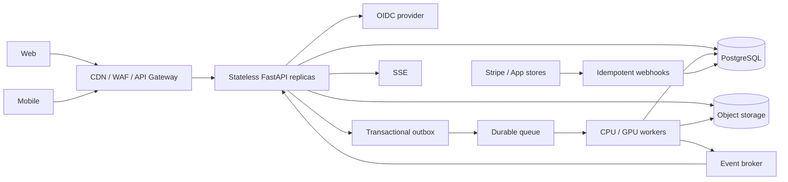

# Готовность NoteKeeper к веб-интеграции и API

> Обновление от 2026-08-27: локальный API foundation и рабочий vertical slice
> реализованы. Доступен режим `notekeeper api`, provider-neutral Bearer sessions,
> workspace-scoped REST routes, multipart audio upload и SSE progress. Разделы
> ниже, описывающие отсутствие HTTP boundary, сохраняют исходную оценку и
> обоснование следующих production-этапов. Текущий контракт описан в
> [api.md](api.md).

## Назначение и границы оценки

Документ повторно оценивает текущее состояние NoteKeeper и описывает путь от
локального приложения к веб-клиенту и публичному API. Он отвечает на два разных
вопроса:

1. Можно ли сейчас добавить HTTP-интерфейс, не переписывая ядро?
2. Можно ли сейчас безопасно публиковать NoteKeeper как multi-user SaaS?

Ответы различаются: **HTTP-адаптер уже можно строить поверх существующего
application layer**, но **публичный production-сервис пока не готов**.

Оценка выполнена для ветки `feats/auth`, коммита `e5ac0d5`. Источниками служили
production-код, тесты и [карта файлов](file_map.md). Контрольный прогон:

```text
317 passed in 55.85s
```

Проценты ниже — инженерная оценка полноты основы, а не формальная метрика
покрытия или сроков.

## Краткий вывод

| Целевой результат | Готовность | Вывод |
| --- | ---: | --- |
| Добавить новый API-адаптер | ~75% | Границы слоёв, use cases, DTO и composition уже подходят |
| Локальный web-MVP на одном доверенном хосте | ~60% | Нужны FastAPI app, schemas, routes, upload и SSE |
| Ограниченная публичная beta | ~35% | Нужны production identity, PostgreSQL, object storage и durable queue |
| Горизонтально масштабируемый production SaaS | ~20% | Дополнительно нужны billing, distributed events, observability и эксплуатационный контур |

Главное изменение относительно предыдущей оценки: пользователи, workspaces,
memberships, роли и tenant-scoped repositories **уже реализованы**. Их больше не
следует планировать с нуля. Они образуют качественную основу, но пока рассчитаны
на локальную инфраструктуру и не заменяют production authentication,
распределённую persistence и HTTP authorization boundary.

## Что изменилось после предыдущей оценки

Предыдущая версия документа фиксировала отсутствие tenancy и синхронный
lifecycle jobs. Текущее состояние заметно сильнее:

- добавлены `User`, `Workspace`, `WorkspaceMembership` и роли
  `owner`/`editor`/`viewer`;
- появился неизменяемый `AccessContext` для actor/workspace/role;
- SQLite repositories создаются с явным `WorkspaceScope` и скрывают чужие
  campaigns, jobs, transcripts, recaps, speaker mappings и остальные ресурсы;
- scoped writes защищены от подмены существующего ID чужого tenant;
- mutation use cases проверяют актуальное membership и запрещают запись
  `viewer`;
- composition разделена на локальный host и неизменяемую
  `ApplicationSession` конкретного пользователя и workspace;
- реализованы локальная регистрация, login и управление membership;
- processing job можно перевести в `queued` и выполнять асинхронно в отдельном
  OS process;
- есть локальные cross-process capacity locks, cancel и recovery потерянных
  worker-процессов;
- progress snapshot сохраняется в SQLite и виден из другого локального runtime;
- число проходящих тестов выросло с 217 до 317, включая tenancy, authorization,
  queue, recovery и composition.

Эти изменения поднимают готовность именно **ядра и локального web-MVP**. Они не
добавили HTTP API, безопасный интернет-login, облачное хранилище, распределённую
очередь или billing.

## Матрица текущей готовности

| Направление | Состояние | Что уже есть | Чего не хватает |
| --- | --- | --- | --- |
| Архитектурные границы | Высокая | `domain`, `application`, ports, infrastructure, composition, интерфейсные адаптеры | Зафиксировать те же границы для API package |
| Application API | Высокая | Команды, результаты и сгруппированный `ApplicationUseCases` | Несколько web-oriented queries и транзакционные операции |
| Multi-tenancy | Средне-высокая | Workspace, membership, роли, scoped repositories и проверки revoked membership | Invitations, lifecycle workspace, tenant-aware constraints в production DB |
| Authorization | Средне-высокая | Ролевые guards на mutation boundary, скрытие чужих ресурсов | HTTP identity dependency, policy matrix, audit и security tests |
| HTTP API | Не реализован | FastAPI, Uvicorn, Pydantic и multipart уже в dependencies | ASGI app, routers, schemas, mappers, error handlers, OpenAPI tests |
| Authentication | Только local/dev | `AuthProvider`, `Authenticator`, local login и sessions для CLI | OIDC/JWT или безопасные server sessions, revocation, recovery, MFA |
| Persistence | Только локальный режим | SQLite schema, migrations и scoped repositories | PostgreSQL, FK/constraints, connection pool, production migrations, unit of work |
| Audio upload | Не реализован для web | Metadata probe и normalization use cases | Multipart/presigned flow, limits, quarantine, checksum, retention |
| Artifact storage | Только один хост | Безопасные managed filesystem paths и `ArtifactRef` | Object storage adapter, signed download, lifecycle policy |
| Job execution | Сильная local-реализация | Async queueing, OS isolation, capacity, cancel, local recovery | Durable broker, leases, retries, dead-letter flow, distributed cancellation |
| Progress | Средняя local-готовность | Persisted latest snapshot и подписки | Авторизованный SSE endpoint, event sequence/replay, общий broker |
| Billing | Не реализован | Длительность аудио доступна в metadata | Subscription, balance, reservation/capture, ledger, webhooks |
| Security/operations | Низкая | Secrets вынесены в settings, ошибки типизированы | Rate limits, CORS/CSRF policy, audit, logs, metrics, traces, alerts, backups |
| Тестирование | Высокая для ядра | 317 проходящих unit/integration tests | API contract, upload, auth attack, billing и distributed recovery tests |

## Сохранённые продуктовые решения

Повторная техническая оценка не меняет продуктовую модель, зафиксированную в
предыдущей версии документа:

- web, iOS и Android используют один versioned API;
- клиенты не обращаются напрямую к DB, queue, object storage или AI providers;
- все пользовательские ресурсы принадлежат workspace;
- подпиской и покупками управляет `owner`;
- участники не тарифицируются как отдельные seats и расходуют общий баланс
  workspace.

Начальная монетизация:

| Продукт | Цена | Объём | Дополнительные правила |
| --- | ---: | ---: | --- |
| `Standard Monthly` | `$14.99` в месяц | 1000 аудиоминут | Все функции, без feature tiers |
| Top-up | `$5.99` | 300 аудиоминут | Не сгорает, повторная покупка разрешена |

Неиспользованные subscription minutes переносятся, но их суммарный остаток
ограничен 2000 минутами. Top-up не входит в этот cap. Новые processing jobs можно
запускать только при активной подписке; готовые данные остаются доступными после
её отмены.

Пользовательский интерфейс показывает минуты и часы, а ledger хранит целые
секунды. Платное использование определяется server-side длительностью исходной
записи. Voice samples, preview/export, manual review и инфраструктурный retry не
списывают минуты повторно. Новый явно подтверждённый полный reprocess считается
новым использованием.

Web-платежи могут идти через Stripe, мобильные — через App Store и Google Play,
но entitlement и balance должны оставаться едиными. Источником истины является
server-side ledger, а не ответ клиента об успешной покупке.

## Основа, которую следует переиспользовать

### Слои и use cases

API должен стать ещё одним входным адаптером рядом с CLI и TUI:

```text
HTTP request
  -> authentication/validation
  -> ApplicationSession для actor + workspace
  -> ApplicationUseCases
  -> scoped ports/repositories
  -> HTTP response
```

Domain не зависит от FastAPI, SQLite, файловой системы или UI. Application
сценарии используют ports, а concrete adapters собираются в composition. Это
позволяет добавить web-интерфейс без переноса бизнес-правил в routes.

Уже пригодны для API:

- CRUD campaigns, participants, voice samples и recordings;
- создание, постановка в очередь, restart, cancel и чтение статуса jobs;
- speaker mapping review;
- recap generation;
- preview/export transcript и recap;
- workspace, membership, campaign и user settings;
- единая фасадная структура `ApplicationUseCases`.

HTTP schemas при этом должны быть отдельными DTO. Нельзя публиковать внутренние
dataclasses напрямую: это случайно связывает внешний контракт с domain model и
затрудняет versioning.

### Request-scoped tenancy

`ApplicationSession` уже содержит пользователя, `AccessContext` и scoped use
cases. Для HTTP запроса composition должна:

1. Проверить access token или server session.
2. Получить `UserId` из доверенной identity, а не из тела запроса.
3. Прочитать целевой `workspace_id` из URL.
4. Проверить актуальное membership.
5. Построить или получить request-scoped `ApplicationSession`.
6. Вызвать use case только через scoped repositories.

Это защищает даже endpoints с прямыми `job_id`, `transcript_id` или `recap_id`:
чужой ID возвращается scoped repository как отсутствующий. Для таких случаев
внешний ответ должен быть `404`, чтобы не раскрывать существование ресурса.

Текущий `SystemScope` следует оставить только workers, migration/repair tools и
явно auditируемым административным сценариям. Его нельзя инъектировать в обычный
HTTP request.

### Роли и живое membership

Роли уже соответствуют минимальной SaaS-модели:

| Роль | Доступ |
| --- | --- |
| `owner` | Workspace settings, members, billing и все campaign operations |
| `editor` | Campaign content, upload, processing, review и artifacts |
| `viewer` | Только чтение доступных workspace resources |

Mutation guards повторно читают membership перед действием, поэтому удалённый
или пониженный участник не продолжает писать только из-за старой роли в session.
Эту проверку необходимо сохранить при кэшировании HTTP sessions.

### Jobs и progress

Текущий local job runtime существенно лучше простого background task:

- HTTP-подходу уже соответствует переход `pending -> queued`;
- тяжёлый pipeline работает в дочернем процессе;
- есть условные status transitions;
- поддерживаются cancel, capacity limits и обнаружение потерянного worker;
- worker получает `workspace_id` вместе с `job_id`;
- progress сохраняет latest snapshot вне памяти UI process.

Поэтому локальный API может возвращать `202 Accepted` сразу после queueing и
использовать существующий manager. Но этот режим допустим только при общем
SQLite-файле и filesystem на одном хосте. File locks, PID registry и in-memory
pending deque не являются distributed queue.

## Блокеры публичного API

### 1. HTTP boundary отсутствует полностью

В `src/notekeeper/interfaces` нет API package, ASGI application, routers,
Pydantic request/response schemas, middleware и exception mapping. Наличие
FastAPI/Uvicorn в `pyproject.toml` означает только готовность dependencies.

Нужно определить:

- versioned prefix `/api/v1`;
- единый error envelope;
- pagination/filtering;
- idempotency для повторяемых mutations;
- правила `ETag`/optimistic concurrency для редактирования;
- OpenAPI compatibility policy;
- ограничения размеров request и upload.

### 2. Local auth нельзя публиковать в интернет

`LocalAuthProvider` хранит login и пароль в JSON открытым текстом, автоматически
создаёт `root/root` и не выдаёт access/refresh tokens. Это сознательный local
adapter, а не заготовка production credential store.

Для публичного API нужен новый adapter за существующим identity boundary:

- предпочтительно внешний OIDC provider;
- проверка issuer, audience, signature, expiry и subject;
- связь provider subject с внутренним `UserId`;
- rotation/revocation refresh sessions;
- email verification, account recovery и blocking;
- MFA минимум для owners и операторов;
- отдельный auditируемый support/admin access.

`LocalAuthProvider` должен быть запрещён production-конфигурацией, а не просто
выключен по соглашению.

### 3. Tenancy реализована, но SaaS lifecycle неполон

Сейчас есть personal workspace и добавление уже зарегистрированного пользователя
по login. Нет:

- создания/архивации/удаления произвольного workspace через application use
  cases;
- invitation с одноразовым token, сроком действия и статусами;
- ownership transfer;
- suspended/deleted states пользователя, workspace и membership;
- tenant deletion/export workflow;
- audit history membership changes.

Эти пробелы не мешают первому локальному API, но блокируют нормальный публичный
onboarding и offboarding.

### 4. SQLite и JSON users не образуют production persistence

Metadata находится в SQLite, пользователи — в отдельном JSON-файле, artifacts —
в filesystem. Между ними нет общей транзакции. Текущая SQLite schema также не
задаёт foreign keys между workspace, campaigns и дочерними ресурсами.

Перед публичным запуском нужны:

- PostgreSQL schema с FK, uniqueness, check constraints и индексами с учётом
  `workspace_id`;
- production migration tool и rollback/forward-fix procedure;
- connection pooling и transaction boundaries;
- unit-of-work для составных application operations;
- outbox для атомарного `job/ledger change + queue event`;
- tenant-scoped repository contract tests для PostgreSQL;
- backup, point-in-time recovery и restore rehearsal.

По возможности `workspace_id` следует хранить непосредственно на крупных
таблицах, а не всегда выводить через цепочку joins. Это упрощает индексы,
partitioning, RLS и защиту запросов.

### 5. Web upload и object storage отсутствуют

Основной import flow принимает локальный `source_path` либо уже известный
managed `artifact_uri`. Browser не может безопасно передать серверу свой путь к
файлу.

Рекомендуемый production flow:

1. `POST /api/v1/workspaces/{workspace_id}/uploads` создаёт upload intent.
2. Клиент загружает файл multipart-частями напрямую в object storage.
3. `POST .../uploads/{upload_id}/complete` фиксирует checksum и размер.
4. Worker проверяет container/codec/duration через server-side probe.
5. Application use case создаёт managed audio track и job.
6. Lifecycle policy удаляет незавершённые и временные objects.

Для локального web-MVP допустим streaming multipart во временный server-owned
файл с жёстким size limit. Нельзя читать большое аудио целиком в память или
передавать пользовательский filesystem path в публичный use case.

Download transcript, recap и audio также должен идти через авторизованный
endpoint или короткоживущий signed URL. Внешний API не должен возвращать
внутренний filesystem path.

### 6. Local queue не является durable distributed queue

Текущий manager восстанавливает сохранённые `queued` jobs и потерянные локальные
workers, но доставка всё ещё зависит от процесса, SQLite и file locks. Между
сохранением job и `enqueue()` нет общей durable transaction/outbox guarantee.

Для нескольких API/worker hosts нужны:

- broker-backed queue;
- атомарный claim/lease и heartbeat;
- bounded retries и dead-letter state;
- idempotent pipeline stages;
- distributed cancellation;
- отдельные CPU/GPU queues и capacity policies;
- recovery после падения worker без повторного billing capture;
- graceful deployment, при котором новые jobs не теряются.

Текущий isolated executor можно сначала переиспользовать внутри одного worker,
не сохраняя за ним ответственность за глобальную доставку.

### 7. Progress пока хранит только latest snapshot

`PersistedProgressEventHub` подходит для локального dashboard и polling, но не
является журналом событий. Нет sequence ID, replay range и общей доставки между
разными hosts.

Первый web-интерфейс может использовать авторизованный SSE endpoint:

```text
GET /api/v1/workspaces/{workspace_id}/jobs/{job_id}/events
```

Endpoint перед подпиской обязан проверить видимость job. Нужны heartbeat,
disconnect cleanup и fallback `GET .../jobs/{job_id}`. Для distributed deployment
progress публикуется через broker, а текущий status и latest snapshot остаются в
PostgreSQL.

### 8. Billing отсутствует

Если сохраняются продуктовые решения предыдущего документа, API должен
поддержать один workspace plan `Standard Monthly` (`$14.99`, 1000 минут) и top-up
(`$5.99`, 300 минут). Эти числа являются продуктовой конфигурацией, а не
реализованным поведением.

Минимальная модель:

```text
Subscription
Entitlement
BalanceGrant
UsageReservation
LedgerEntry (immutable)
PaymentEvent (provider idempotency key)
```

Единица хранения — целые секунды. До queueing job в одной транзакции создаются
reservation, job и outbox event. После вычисления происходит capture или
release. Webhook handlers обязаны быть idempotent; клиентский ответ об успешной
оплате не является источником истины.

Billing следует добавлять после transaction/outbox foundation. Иначе quota и
job lifecycle невозможно согласовать при retry и падениях.

### 9. Нет production security и operations contour

До публичной beta требуются как минимум:

- allowlist CORS; при cookie auth — CSRF protection;
- rate limits для login, upload, queue, recap и SSE;
- request/body/file limits и timeouts;
- malware/container validation для uploads;
- structured logs с request/user/workspace/job correlation IDs;
- metrics по API latency, queue age, stage duration, GPU capacity и provider
  cost;
- traces через API, queue и worker;
- audit log для membership, billing, export и destructive actions;
- health/readiness endpoints, graceful shutdown и deployment runbook;
- secret manager, key rotation, backup/restore и incident response.

## Целевая архитектура



Свойства целевой системы:

- API replicas stateless и не владеют job lifecycle;
- authenticated identity определяет actor, membership — доступ;
- PostgreSQL является источником истины для tenancy, job state и billing;
- object storage является источником истины для пользовательских blobs;
- durable queue отвечает за доставку, workers — за lease и выполнение;
- повтор запроса или event не создаёт второй job и не списывает минуты дважды;
- web и mobile используют один versioned contract.

## Рекомендуемый HTTP-контракт

### Базовые правила

- Prefix: `/api/v1`.
- JSON поля и enum values: `snake_case`.
- Timestamp: UTC, RFC 3339.
- IDs: opaque strings; UUID не является доказательством доступа.
- Mutations, допускающие retry: `Idempotency-Key`.
- Lists: cursor pagination с ограниченным `limit`.
- Long operations: `202 Accepted` и resource/status URL.
- Неизвестный или чужой tenant resource: `404`.
- Недостаточная роль в доступном workspace: `403`.
- Domain/application conflict: `409` или `422` по стабильному error code.
- Неожиданная ошибка: `500` без traceback и внутренних path в response.

Пример error envelope:

```json
{
  "error": {
    "code": "job_not_queueable",
    "message": "Processing job cannot be queued from its current state",
    "request_id": "req_...",
    "details": {}
  }
}
```

### Минимальный vertical slice

Первый API slice должен доказать request-scoped tenancy и async jobs:

```text
GET    /api/v1/me
GET    /api/v1/workspaces
GET    /api/v1/workspaces/{workspace_id}/campaigns
POST   /api/v1/workspaces/{workspace_id}/campaigns
GET    /api/v1/workspaces/{workspace_id}/campaigns/{campaign_id}
POST   /api/v1/workspaces/{workspace_id}/campaigns/{campaign_id}/recordings
POST   /api/v1/workspaces/{workspace_id}/jobs/{job_id}/queue
GET    /api/v1/workspaces/{workspace_id}/jobs/{job_id}
GET    /api/v1/workspaces/{workspace_id}/jobs/{job_id}/events
```

После него добавляются participants, samples, review, transcripts, recaps,
settings и members. Billing endpoints не должны блокировать локальный MVP, но
обязательны до платного публичного запуска.

## Размещение нового кода

С учётом текущих правил проекта рекомендуемая структура:

```text
src/notekeeper/interfaces/api/
  __init__.py             # только явный facade
  app.py                  # FastAPI app factory
  dependencies.py         # identity и request-scoped session
  error_handlers.py       # application/domain -> HTTP
  routers/
    auth.py
    workspaces.py
    campaigns.py
    recordings.py
    jobs.py
    transcripts.py
    recaps.py
  schemas/
    common.py
    identity.py
    workspace.py
    campaign.py
    recording.py
    job.py
  mappers/
    campaign.py
    job.py
    transcript.py

src/notekeeper/composition/
  web.py                   # production/dev web composition and lifespan
```

Routes должны только валидировать transport DTO, получать dependency, вызывать
use case и преобразовывать результат. Проверки ролей, job transitions, billing и
tenant ownership не должны дублироваться в FastAPI handlers.

Для web composition лучше отделить долгоживущие ресурсы host-level (pool,
clients, broker) от request-scoped identity/session. Текущий
`LocalApplicationHost` можно использовать как dev composition, но не как
production service container без замены local adapters.

## План реализации

### Этап 1. API foundation и локальный vertical slice

- Создать `interfaces/api` и `composition/web.py`.
- Добавить app factory и lifespan для старта/остановки local job manager.
- Реализовать identity/session dependency с обязательным `workspace_id`.
- Добавить Pydantic schemas, mappers и единый error envelope.
- Реализовать минимальный vertical slice выше.
- Возвращать `202` после queueing, не ждать pipeline в request thread.
- Добавить OpenAPI snapshot/contract tests и cross-tenant API tests.
- Явно маркировать SQLite/filesystem/local auth как development profile.

Результат: браузерный прототип на одном хосте, не публичный SaaS.

### Этап 2. Upload, artifacts и live progress

- Реализовать streaming multipart import для dev.
- Добавить upload intent port и object storage adapter для production.
- Добавить авторизованные download endpoints/signed URLs.
- Реализовать SSE с heartbeat, cleanup и polling fallback.
- Ввести size, duration, codec и concurrency limits.
- Покрыть interrupted upload, disconnect и access revocation tests.

### Этап 3. Public data and worker foundation

- Перенести metadata и identity mapping в PostgreSQL.
- Добавить schema constraints, migration tooling и repository contract tests.
- Ввести unit of work и transactional outbox.
- Заменить local queue ownership на broker, lease и retry policy.
- Подключить distributed event broker.
- Реализовать OIDC/JWT adapter и запрет local auth в production.
- Добавить invitation и workspace lifecycle.

Результат: техническая основа ограниченной публичной beta.

### Этап 4. Billing и публичная beta

- Реализовать subscription/entitlement/ledger.
- Добавить atomic reservation/capture/release вокруг queueing.
- Подключить idempotent payment webhooks.
- Добавить quota/cost/rate controls.
- Провести tenancy, authorization и billing concurrency tests.

### Этап 5. Production hardening

- Structured logs, metrics, traces, alerts и audit trail.
- Backup/restore rehearsal, retention и tenant deletion.
- Load, soak, worker-crash и broker/database failover tests.
- WAF, secrets rotation, incident/deployment runbooks.
- Mobile contract validation и backward-compatibility policy.

## Обязательные тестовые ворота

### Для локального web-MVP

- Все текущие 317 тестов продолжают проходить.
- API tests проверяют каждую группу HTTP status/error codes.
- Пользователь A не читает и не изменяет ресурсы workspace B даже по прямому ID.
- `viewer` не выполняет mutations; изменение роли действует без новой login
  session.
- Queue endpoint быстро возвращает `202`, job завершается вне request lifecycle.
- SSE не позволяет подписаться на чужой job и корректно закрывает listener.

### Для публичной beta

- Local auth невозможно включить production-конфигурацией.
- OIDC negative tests покрывают issuer, audience, expiry, signature и revoked
  session.
- Upload tests покрывают размер, тип, повреждение, checksum, abort и cleanup.
- PostgreSQL repository contract suite повторяет tenant isolation tests SQLite.
- Job publish атомарен через outbox; потеря API/worker не теряет queued job.
- Retry не создаёт второй artifact, job или billing capture.
- Webhooks устойчивы к дублям и перестановке событий.
- Rate limits и audit events проверяются автоматически.

### Для production

- Load profile подтверждает API latency и queue-age SLO.
- Worker crash, lease expiry и cancellation имеют детерминированный результат.
- Restore из backup регулярно проверяется.
- Нет неограниченных in-memory collections и polling loops на пользователя.
- Security review не находит путей обхода workspace scope или signed download.

## Критерии готовности

### Web-MVP готов, когда

- есть versioned FastAPI contract и web-клиент не обращается к filesystem/DB;
- каждый request строится из authenticated actor и проверенного workspace;
- upload создаёт managed artifact;
- job запускается асинхронно и наблюдается через status/SSE;
- cross-tenant и role API tests проходят.

### Публичная beta готова, когда

- local auth, SQLite, local filesystem и local queue заменены в production
  profile;
- OIDC, PostgreSQL, object storage, outbox и durable queue работают end-to-end;
- invitations, lifecycle, rate limiting, audit и backups реализованы;
- billing согласован с job lifecycle, если beta платная.

### Production SaaS готов, когда

- API и workers масштабируются независимо;
- все mutations и external events идемпотентны;
- failure/recovery сценарии и restore подтверждены тестами;
- SLO, alerts, cost controls и incident procedures проверены эксплуатацией.

## Итог

NoteKeeper больше не находится на стадии «сначала спроектировать tenancy и
асинхронные jobs». Эти части уже имеют рабочую локальную реализацию и хорошее
тестовое покрытие. Проект **готов к немедленному добавлению тонкого API-адаптера и
локального web-MVP без переписывания domain/application**.

Одновременно проект **не готов к прямому публичному размещению**. Критический
путь проходит не через переписывание бизнес-логики, а через создание HTTP
boundary и замену local adapters: plaintext local auth, SQLite/JSON persistence,
filesystem storage и process-local queue. Наиболее безопасная последовательность
— сначала вертикальный API slice на текущем ядре, затем transaction/outbox,
production identity, PostgreSQL, object storage и durable workers, и только после
этого billing и публичный запуск.
